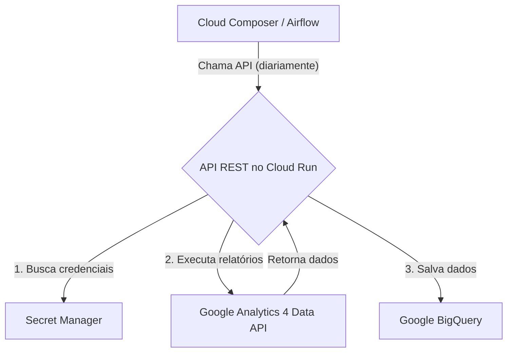

# API de Extração de Dados do Google Analytics 4

**Autor:** Manus AI (a pedido de Gustavo)
**Data:** Janeiro de 2026
**Versão:** 2.0.0

---

## 1. Visão Geral

Esta API foi desenvolvida para automatizar a extração de dados da **API Data do Google Analytics 4 (GA4)** e realizar a carga em tabelas no **Google BigQuery**. O principal objetivo é permitir a coleta diária de dados de múltiplas propriedades GA4, organizando-os em tabelas específicas para dimensões e métricas, facilitando análises futuras e a criação de dashboards.

A solução é implementada como uma API REST em **Python com Flask**, projetada para ser implantada no **Google Cloud Run**. A orquestração da carga diária é gerenciada por **Apache Airflow** (via Google Cloud Composer), que aciona a API para processar os dados do dia anterior (D-1).

### 1.1. Principais Funcionalidades

- **Extração por Categoria:** A API organiza as consultas ao GA4 em relatórios pré-definidos, agrupados por categorias de dimensões e métricas.
- **Estrutura de Tabelas Dinâmica:** Cria e gerencia tabelas no BigQuery com schemas específicos para cada tipo de relatório, particionadas por data para otimizar consultas.
- **Múltiplas Propriedades:** Suporte para processar múltiplas propriedades GA4 em uma única execução, de forma paralela.
- **Configuração Centralizada:** Todas as configurações, como nomes de tabelas, dimensões, métricas e projetos, são gerenciadas em um único arquivo (`config.py`).
- **Orquestração com Airflow:** Inclui DAGs Airflow prontas para uso, utilizando a Taskflow API para orquestrar a carga diária, execuções manuais e backfill de dados históricos.
- **Deploy Simplificado:** Projetada para deploy rápido no Cloud Run usando Docker.

### 1.2. Arquitetura da Solução

A arquitetura é composta por três componentes principais:

1.  **API REST (Cloud Run):** O núcleo da solução. Uma aplicação Flask que expõe endpoints para executar os relatórios do GA4.
2.  **BigQuery:** O data warehouse de destino, onde os dados extraídos são armazenados em tabelas particionadas.
3.  **Cloud Composer (Airflow):** O orquestrador que agenda e executa a carga diária, chamando a API no Cloud Run.



---

## 2. Estrutura do Projeto

O projeto está localizado na pasta `apis/google-analytics-4` e segue a estrutura padrão de uma aplicação Python.

```
/google-analytics-4
|-- dags/                     # DAGs Airflow
|   |-- dag_ga4_daily_load.py
|-- src/                      # Código-fonte da API
|   |-- __init__.py
|   |-- bigquery_writer.py    # Módulo para escrever no BigQuery
|   |-- ga4_client.py         # Cliente para a API GA4
|   |-- models.py             # Modelos de dados (Pydantic/Dataclasses)
|   |-- report_manager.py     # Gerenciador de relatórios por categoria
|   |-- secret_manager.py     # Cliente para o Secret Manager
|-- .gitignore
|-- config.py                 # Arquivo principal de configuração
|-- Dockerfile                # Definição do container para Cloud Run
|-- main.py                   # Entrypoint da API Flask (Cloud Run)
|-- README.md                 # Documentação original do projeto
|-- DOC.md                    # Esta documentação
|-- requirements.txt          # Dependências Python
```

---

## 3. Configuração

Antes de implantar e executar a API, é necessário realizar algumas configurações.

### 3.1. Arquivo `config.py`

Este é o arquivo central para todas as configurações. As principais seções a serem revisadas são:

- **`GCPConfig`**: Defina o `PROJECT_ID` do seu projeto no Google Cloud e o `SECRET_ID` onde as credenciais da conta de serviço do GA4 estão armazenadas.
- **`TableConfig`**: Define os nomes das tabelas, descrições, e as dimensões/métricas para cada relatório. O padrão já está configurado conforme solicitado.
- **`GA4Properties`**: **Esta seção é importante.** Você deve adicionar os IDs das propriedades do Google Analytics 4 que deseja processar. Exemplo:

  ```python
  class GA4Properties:
      PROPERTIES = [
          {"id": "123456789", "name": "Meu Site Principal"},
          {"id": "987654321", "name": "Meu App Mobile"},
      ]
  ```

### 3.2. Credenciais (Secret Manager)

A API utiliza uma conta de serviço para se autenticar no Google Analytics e no BigQuery. Siga estes passos:

1.  Crie uma **Conta de Serviço** no IAM do seu projeto GCP.
2.  Conceda as seguintes permissões a ela:
    *   `Analytics User` (ou `Analytics Viewer`)
    *   `BigQuery Data Editor`
    *   `BigQuery Job User`
3.  Adicione o e-mail desta conta de serviço como usuário na sua propriedade do Google Analytics 4 com permissão de **Leitor**.
4.  Gere uma chave **JSON** para a conta de serviço.
5.  Salve o conteúdo completo do arquivo JSON como um novo secret no **Secret Manager**. O nome do secret deve ser o mesmo definido em `GCPConfig.SECRET_ID` (padrão: `ga4-credentials`).

### 3.3. Variáveis do Airflow

Para que a DAG do Airflow funcione corretamente, configure as seguintes variáveis no seu ambiente Airflow (Cloud Composer):

- **`ga4_api_url`**: A URL do serviço após o deploy no Cloud Run.
- **`ga4_property_ids`**: Uma lista em formato JSON com os IDs das propriedades a serem processadas pela DAG. Exemplo: `["123456789", "987654321"]`

---

## 4. Endpoints da API

A API expõe vários endpoints para executar relatórios e verificar o status.

**URL Base:** `[URL_DO_CLOUD_RUN]`

### 4.1. Endpoint Principal

#### `POST /report/all`

Executa **todos** os relatórios (dimensões e métricas) para uma única propriedade. Este é o endpoint principal usado pela DAG do Airflow.

- **Request Body:**
  ```json
  {
      "property_id": "123456789",
      "start_date": "yesterday",
      "end_date": "yesterday"
  }
  ```
- **Success Response (200):**
  ```json
  {
    "status": "success",
    "property_id": "123456789",
    "results": {
      "dimensions": { ... },
      "metrics": { ... },
      "summary": {
        "total_reports": 12,
        "successful": 12,
        "failed": 0,
        "total_rows_processed": 54321
      }
    }
  }
  ```

### 4.2. Endpoints por Categoria

#### `POST /report/dimension/<table_name>`

Executa um único relatório de dimensão.

- **URL Param:** `table_name` (ex: `TB_001_GA4_DIM_USUARIO`)
- **Request Body:** Mesmo que `/report/all`.

#### `POST /report/metric/<table_name>`

Executa um único relatório de métrica.

- **URL Param:** `table_name` (ex: `TB_008_GA4_MET_USUARIOS`)
- **Request Body:** Mesmo que `/report/all`.

### 4.3. Endpoints de Status

- **`GET /`**: Health check básico.
- **`GET /config`**: Retorna a configuração da API.
- **`GET /tables`**: Lista todas as tabelas configuradas.

---

## 5. Orquestração com Airflow

O arquivo `dags/dag_ga4_daily_load.py` contém três DAGs prontas para uso:

1.  **`dag_ga4_daily_load`**: A DAG principal, que executa diariamente para todas as propriedades configuradas na variável `ga4_property_ids`.
2.  **`dag_ga4_single_property`**: Uma DAG para execução manual, permitindo processar uma única propriedade sob demanda.
3.  **`dag_ga4_backfill`**: Uma DAG manual para carregar dados históricos para um período específico.

O fluxo da DAG principal é o seguinte:

1.  **Valida as Configurações:** Verifica se a API está online e se as variáveis necessárias existem.
2.  **Processa Propriedades:** Cria uma task dinâmica para cada `property_id`, executando o endpoint `/report/all` em paralelo.
3.  **Consolida Resultados:** Agrupa os resultados de todas as execuções.
4.  **Notifica Conclusão:** Loga um resumo final da execução.

---

## 6. Deploy no Cloud Run

Para implantar a API no Cloud Run, siga estes passos:

1.  **Ative as APIs necessárias:** Cloud Build, Cloud Run, Artifact Registry.
2.  **Configure o Docker:** Crie um repositório no Artifact Registry para armazenar a imagem do container.

    ```bash
    gcloud artifacts repositories create <repo-name> --repository-format=docker --location=<region>
    ```

3.  **Construa e envie a imagem:** A partir da raiz do repositório, execute o comando do Cloud Build.

    ```bash
    gcloud builds submit --region=<region> --tag <region>-docker.pkg.dev/<project-id>/<repo-name>/ga4-api:latest .
    ```

4.  **Faça o deploy no Cloud Run:**

    ```bash
    gcloud run deploy ga4-api \
        --image <region>-docker.pkg.dev/<project-id>/<repo-name>/ga4-api:latest \
        --platform managed \
        --region <region> \
        --allow-unauthenticated \
        --service-account <email-da-sua-conta-de-servico>
    ```

Após o deploy, a URL do serviço será exibida. Atualize a variável `ga4_api_url` no Airflow com esta URL.

---

## 7. Referências

- [1] [Google Analytics Data API Overview](https://developers.google.com/analytics/devguides/reporting/data/v1?hl=pt-br)
- [2] [Google Cloud Run Documentation](https://cloud.google.com/run/docs)
- [3] [Google Cloud Composer Documentation](https://cloud.google.com/composer/docs)
