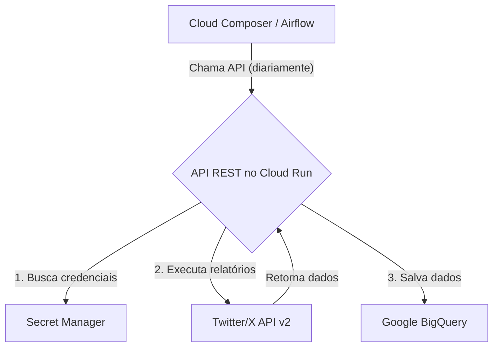

# API de Extração de Dados do Twitter/X

**Autor:** Manus AI (a pedido de Gustavo)
**Data:** Janeiro de 2026
**Versão:** 1.0.0

---

## 1. Visão Geral

Esta API foi desenvolvida para automatizar a extração de dados da **API do Twitter/X v2** e realizar a carga em tabelas no **Google BigQuery**. O principal objetivo é permitir a coleta diária de dados de múltiplas contas do Twitter, organizando-os em tabelas específicas para perfil, posts e métricas adicionais.

A solução é implementada como uma API REST em **Python com Flask**, projetada para ser implantada no **Google Cloud Run**. A orquestração da carga diária é gerenciada por **Apache Airflow** (via Google Cloud Composer), que aciona a API para processar os dados de um período configurável (padrão: D-7 a D-2).

### 1.1. Principais Funcionalidades

- **Extração por Categoria:** A API organiza as consultas ao Twitter em três relatórios principais: perfil, posts e métricas adicionais.
- **Estrutura de Tabelas Dinâmica:** Cria e gerencia tabelas no BigQuery com schemas específicos para cada tipo de relatório, particionadas por data.
- **Múltiplas Contas:** Suporte para processar múltiplas contas do Twitter em uma única execução, de forma paralela.
- **Configuração Centralizada:** Todas as configurações, como nomes de tabelas, contas e projetos, são gerenciadas em um único arquivo (`config.py`).
- **Orquestração com Airflow:** Inclui DAGs Airflow prontas para uso, utilizando a Taskflow API para orquestrar a carga diária, execuções manuais e backfill de dados históricos.
- **Deploy Simplificado:** Projetada para deploy rápido no Cloud Run usando Docker.

### 1.2. Arquitetura da Solução

A arquitetura é composta por três componentes principais:

1.  **API REST (Cloud Run):** O núcleo da solução. Uma aplicação Flask que expõe endpoints para executar os relatórios do Twitter.
2.  **BigQuery:** O data warehouse de destino, onde os dados extraídos são armazenados em tabelas particionadas.
3.  **Cloud Composer (Airflow):** O orquestrador que agenda e executa a carga diária, chamando a API no Cloud Run.



---

## 2. Estrutura do Projeto

O projeto está localizado na pasta `apis/twitter` e segue a estrutura padrão de uma aplicação Python.

```
/twitter
|-- dags/                     # DAGs Airflow
|   |-- dag_twitter_daily_load.py
|-- src/                      # Código-fonte da API
|   |-- __init__.py
|   |-- bigquery_writer.py    # Módulo para escrever no BigQuery
|   |-- secret_manager.py     # Cliente para o Secret Manager
|   |-- twitter_client.py     # Cliente para a API do Twitter
|-- .gitignore
|-- config.py                 # Arquivo principal de configuração
|-- Dockerfile                # Definição do container para Cloud Run
|-- main.py                   # Entrypoint da API Flask (Cloud Run)
|-- README.md                 # Esta documentação
|-- requirements.txt          # Dependências Python
```

---

## 3. Configuração

Antes de implantar e executar a API, é necessário realizar algumas configurações.

### 3.1. Arquivo `config.py`

Este é o arquivo central para todas as configurações. As principais seções a serem revisadas são:

- **`GCPConfig`**: Defina o `PROJECT_ID` do seu projeto no Google Cloud, o `DATASET_ID` no BigQuery, e os `SECRET_ID`s para as credenciais.
- **`TwitterAccountsConfig`**: **Esta seção é importante.** Você deve adicionar as contas do Twitter que deseja processar. Exemplo:

  ```python
  class TwitterAccountsConfig:
      ACCOUNTS = [
          TwitterAccount(
              username="xdevelopers",
              user_id="2244994945",
              name="X Developers"
          ),
      ]
  ```

- **`DateConfig`**: Define o período de extração (padrão: D-7 a D-2).

### 3.2. Credenciais (Secret Manager)

A API utiliza credenciais para se autenticar no Twitter e no BigQuery.

1.  **Credenciais do BigQuery:**
    - Crie uma **Conta de Serviço** no IAM do seu projeto GCP.
    - Conceda as permissões `BigQuery Data Editor` e `BigQuery Job User`.
    - Gere uma chave **JSON** e salve o conteúdo no Secret Manager com o nome definido em `GCPConfig.SECRET_ID_BQ` (padrão: `Acesso_BQ`).

2.  **Credenciais do Twitter:**
    - Obtenha um **Bearer Token** no seu portal de desenvolvedor do Twitter/X.
    - Salve este token no Secret Manager com o nome definido em `GCPConfig.SECRET_ID_TWITTER` (padrão: `twitter-bearer-token`).

### 3.3. Variáveis do Airflow

Para que a DAG do Airflow funcione corretamente, configure as seguintes variáveis no seu ambiente Airflow (Cloud Composer):

- **`twitter_api_url`**: A URL do serviço após o deploy no Cloud Run.
- **`twitter_accounts`**: Uma lista em formato JSON com as contas a serem processadas pela DAG. Exemplo: `[{"username": "xdevelopers", "user_id": "2244994945", "name": "X Developers"}]`

---

## 4. Endpoints da API

A API expõe vários endpoints para executar relatórios e verificar o status.

**URL Base:** `[URL_DO_CLOUD_RUN]`

### 4.1. Endpoint Principal

#### `POST /report/all`

Executa **todos** os relatórios (perfil, posts, métricas adicionais) para uma única conta.

- **Request Body:**
  ```json
  {
      "username": "xdevelopers",
      "user_id": "2244994945",
      "start_date": "2024-01-01",  // opcional
      "end_date": "2024-01-07"     // opcional
  }
  ```

### 4.2. Endpoint em Lote

#### `POST /report/batch`

Executa relatórios para múltiplas contas. Se `accounts` não for fornecido, usa todas as contas configuradas.

- **Request Body:**
  ```json
  {
      "accounts": [
          {"username": "conta1", "user_id": "123"},
          {"username": "conta2", "user_id": "456"}
      ],
      "start_date": "2024-01-01",  // opcional
      "end_date": "2024-01-07"     // opcional
  }
  ```

### 4.3. Endpoints de Status

- **`GET /`**: Health check básico.
- **`GET /config`**: Retorna a configuração da API.
- **`GET /tables`**: Lista todas as tabelas configuradas.
- **`GET /accounts`**: Lista todas as contas configuradas.

---

## 5. Orquestração com Airflow

O arquivo `dags/dag_twitter_daily_load.py` contém três DAGs prontas para uso:

1.  **`dag_twitter_daily_load`**: A DAG principal, que executa diariamente para todas as contas configuradas na variável `twitter_accounts`.
2.  **`dag_twitter_single_account`**: Uma DAG para execução manual, permitindo processar uma única conta sob demanda.
3.  **`dag_twitter_backfill`**: Uma DAG manual para carregar dados históricos para um período específico.

---

## 6. Deploy no Cloud Run

O processo de deploy é o mesmo da API do Google Analytics 4. Use o `Dockerfile` fornecido para construir e enviar a imagem para o Artifact Registry, e então faça o deploy no Cloud Run.

---

## 7. Referências

- [1] [X API v2 Documentation](https://developer.x.com/en/docs/x-api)
- [2] [Google Cloud Run Documentation](https://cloud.google.com/run/docs)
- [3] [Google Cloud Composer Documentation](https://cloud.google.com/composer/docs)
